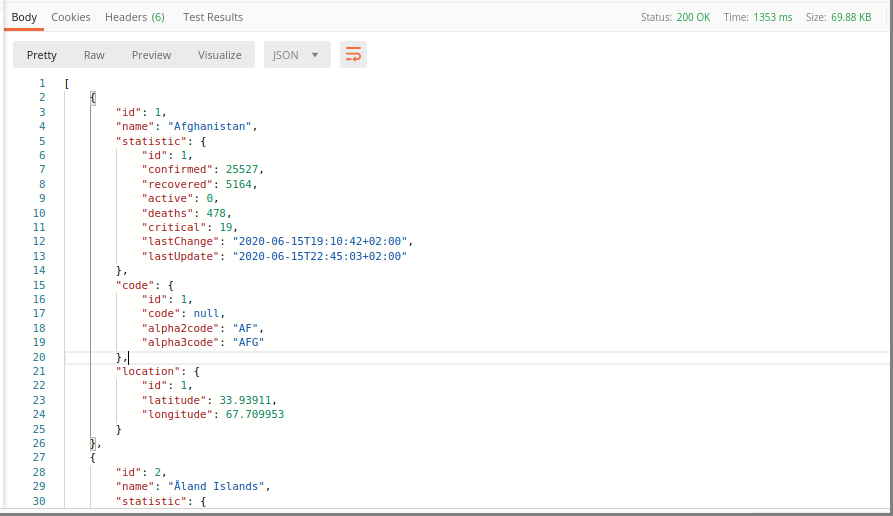
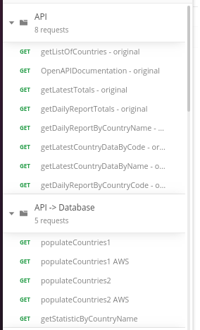
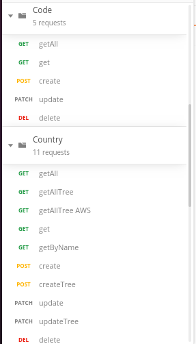
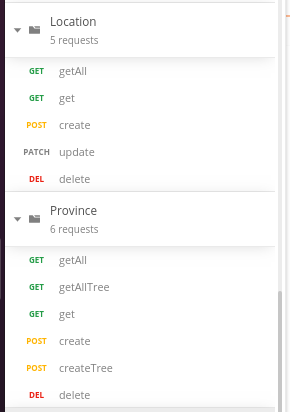
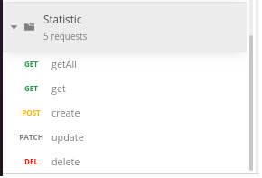

# Examenarbete ITHS 
@author: Maksym Gorbunov

* Java 8, Maven
* MySql, JPA
* Rest API, RestTemplate
* Lombok, ModelMapper 

* VueJs
* VueX, cors, moduls, router, axios 
* Js, Html. Css

Total endpoints: 45

# Result	

